# EvalHub SDK

**Framework Adapter SDK for TrustyAI EvalHub Integration**

The EvalHub SDK provides a standardized way to create framework adapters that can be consumed by EvalHub, enabling a "Bring Your Own Framework" (BYOF) approach for evaluation frameworks.

## Overview

The SDK creates a common API layer that allows EvalHub to communicate with ANY evaluation framework. Users only need to write minimal "glue" code to connect their framework to the standardized interface.

```
EvalHub → (Standard API) → Your Framework Adapter → Your Evaluation Framework
```

## Architecture

```mermaid
graph LR
    EH[EvalHub]
    FA[Framework Adapter<br/>SDK + Glue Code]
    YF[Your Framework<br/>LMEval, Custom,<br/>RAGAS, etc.]
    API[Standard API<br/>─────────────<br/>/health<br/>/info<br/>/benchmarks<br/>/evaluations]

    EH <--> FA
    FA <--> YF
    EH --> API
    FA --> API
```



### Package Organization

The SDK is organized into distinct, focused packages:

**🏗️ Core (`evalhub.models`)** - Shared data models and utilities
- Request/response models for API communication
- Common data structures used by both clients and adapters

**🔧 Adapter SDK (`evalhub.adapter`)** - Components for building framework adapters
- Framework adapter base class and configuration
- Server components for hosting your adapter
- API routing and endpoint implementations
- CLI tools for running and managing adapters

**📡 Client SDK (`evalhub.adapter.client`)** - Components for communicating with adapters
- HTTP client for connecting to framework adapters
- Discovery service for finding and managing multiple adapters
- Async communication patterns

### Key Components

1. **Standard API**: Common REST endpoints that all adapters must implement
2. **Framework Adapter Base Class**: Abstract base class with the adapter contract (`evalhub.adapter.models`)
3. **Server Components**: FastAPI-based server for exposing the standard API (`evalhub.adapter.server`)
4. **Client Components**: HTTP client for EvalHub to communicate with adapters (`evalhub.adapter.client`)
5. **Data Models**: Pydantic models for requests, responses, and metadata (`evalhub.models`)

## Quick Start

### 1. Installation

```bash
# Install from PyPI (when available)
pip install evalhub-sdk

# Install from source
git clone https://github.com/trustyai-explainability/evalhub-sdk.git
cd evalhub-sdk
pip install -e .[dev]
```

### 2. Create Your Adapter

Create a new Python file for your adapter:

```python
# my_framework_adapter.py
from evalhub.adapter import FrameworkAdapter, AdapterConfig
from evalhub.models import *

class MyFrameworkAdapter(FrameworkAdapter):
    async def initialize(self):
        """Initialize your framework here"""
        # Load your evaluation framework
        pass

    async def list_benchmarks(self) -> List[BenchmarkInfo]:
        """Return available benchmarks from your framework"""
        return [
            BenchmarkInfo(
                benchmark_id="my_benchmark",
                name="My Custom Benchmark",
                description="A custom benchmark",
                category="reasoning",
                metrics=["accuracy", "f1_score"]
            )
        ]

    async def submit_evaluation(self, request: EvaluationRequest) -> EvaluationJob:
        """Submit evaluation to your framework"""
        # Translate request to your framework's format
        # Run evaluation
        # Return job information
        pass

    # Implement other required methods...
```

### 3. Run Your Adapter

```python
# run_adapter.py
from evalhub.adapter import AdapterServer, AdapterConfig
from my_framework_adapter import MyFrameworkAdapter

config = AdapterConfig(
    framework_id="my_framework",
    adapter_name="My Framework Adapter",
    port=8080
)

adapter = MyFrameworkAdapter(config)
server = AdapterServer(adapter)
server.run()
```

### 4. Test Your Adapter

```bash
# Run your adapter
python run_adapter.py

# Test health check
curl http://localhost:8080/api/v1/health

# Get framework info
curl http://localhost:8080/api/v1/info

# List benchmarks
curl http://localhost:8080/api/v1/benchmarks
```

## Package Organization Guide

The EvalHub SDK is organized into distinct packages based on your use case:

### 📦 **Which Package Should I Use?**

| Use Case | Primary Package | Description |
|----------|----------------|-------------|
| **Building an Adapter** | `evalhub.adapter` | You're creating a new framework adapter |
| **Connecting to Adapters** | `evalhub.adapter.client` | You're building a client to communicate with adapters |
| **Data Models** | `evalhub.models` | You need request/response models for API communication |
| **CLI Tools** | `evalhub.adapter.cli` | You want to run/manage adapters from command line |

### 🎯 **Import Patterns by Role**

**Framework Adapter Developer:**
```python
# Building your adapter
from evalhub.adapter.models import FrameworkAdapter, AdapterConfig
from evalhub.adapter.server import AdapterServer
from evalhub.models.api import EvaluationRequest, EvaluationJob

# Running your adapter
from evalhub.adapter import *  # Everything you need
```

**Client Developer (EvalHub team):**
```python
# Communicating with adapters
from evalhub.adapter.client import AdapterClient, AdapterDiscovery
from evalhub.models.api import EvaluationRequest, ModelConfig
```

**Integration Developer:**
```python
# Using both sides of the API
from evalhub.adapter.client import AdapterClient        # Client side
from evalhub.adapter.models import FrameworkAdapter      # Adapter side
from evalhub.models.api import *                         # Shared models
```

## Complete Examples

### LightEval Framework Example
See [examples/lighteval_adapter/](examples/lighteval_adapter/) for a production-ready example with:

Try the demo (notebook runs **outside** the container):
```bash
# Container: LightEval + adapter
# Notebook: External HTTP client
cd examples/
jupyter notebook lighteval_demo_external.ipynb
```

## Standard API Endpoints

All framework adapters expose the same REST API:

| Endpoint | Method | Description |
|----------|--------|-------------|
| `/health` | GET | Health check |
| `/info` | GET | Framework information |
| `/benchmarks` | GET | List available benchmarks |
| `/benchmarks/{id}` | GET | Get benchmark details |
| `/evaluations` | POST | Submit evaluation job |
| `/evaluations/{job_id}` | GET | Get job status |
| `/evaluations/{job_id}/results` | GET | Get evaluation results |
| `/evaluations/{job_id}` | DELETE | Cancel job |
| `/evaluations/{job_id}/stream` | GET | Stream job updates |

### Example API Usage

```bash
# Submit evaluation
curl -X POST http://localhost:8080/api/v1/evaluations \
  -H "Content-Type: application/json" \
  -d '{
    "benchmark_id": "my_benchmark",
    "model": {
      "name": "gpt-4",
      "provider": "openai",
      "parameters": {
        "temperature": 0.1,
        "max_tokens": 100
      }
    },
    "num_examples": 100,
    "experiment_name": "test_evaluation"
  }'

# Check job status
curl http://localhost:8080/api/v1/evaluations/{job_id}

# Get results
curl http://localhost:8080/api/v1/evaluations/{job_id}/results
```

## Framework Adapter Interface

### Required Methods

Your adapter must implement these abstract methods:

```python
class FrameworkAdapter(ABC):
    @abstractmethod
    async def initialize(self) -> None:
        """Initialize the framework"""

    @abstractmethod
    async def get_framework_info(self) -> FrameworkInfo:
        """Get framework information"""

    @abstractmethod
    async def list_benchmarks(self) -> List[BenchmarkInfo]:
        """List available benchmarks"""

    @abstractmethod
    async def get_benchmark_info(self, benchmark_id: str) -> Optional[BenchmarkInfo]:
        """Get benchmark details"""

    @abstractmethod
    async def submit_evaluation(self, request: EvaluationRequest) -> EvaluationJob:
        """Submit evaluation job"""

    @abstractmethod
    async def get_job_status(self, job_id: str) -> Optional[EvaluationJob]:
        """Get job status"""

    @abstractmethod
    async def get_evaluation_results(self, job_id: str) -> Optional[EvaluationResponse]:
        """Get evaluation results"""

    @abstractmethod
    async def cancel_job(self, job_id: str) -> bool:
        """Cancel job"""

    @abstractmethod
    async def health_check(self) -> HealthResponse:
        """Perform health check"""

    @abstractmethod
    async def shutdown(self) -> None:
        """Graceful shutdown"""
```

### Data Models

Key data models for requests and responses:

```python
# Evaluation request from EvalHub
class EvaluationRequest(BaseModel):
    benchmark_id: str
    model: ModelConfig
    num_examples: Optional[int] = None
    num_few_shot: Optional[int] = None
    benchmark_config: Dict[str, Any] = {}
    experiment_name: Optional[str] = None

# Model configuration
class ModelConfig(BaseModel):
    name: str
    provider: Optional[str] = None
    parameters: Dict[str, Any] = {}
    device: Optional[str] = None
    batch_size: Optional[int] = None

# Evaluation job tracking
class EvaluationJob(BaseModel):
    job_id: str
    status: JobStatus  # PENDING, RUNNING, COMPLETED, FAILED, CANCELLED
    request: EvaluationRequest
    submitted_at: datetime
    started_at: Optional[datetime] = None
    completed_at: Optional[datetime] = None
    progress: Optional[float] = None  # 0.0 to 1.0
    error_message: Optional[str] = None

# Evaluation results
class EvaluationResponse(BaseModel):
    job_id: str
    benchmark_id: str
    model_name: str
    results: List[EvaluationResult]
    overall_score: Optional[float] = None
    num_examples_evaluated: int
    completed_at: datetime
    duration_seconds: float

# Individual metric result
class EvaluationResult(BaseModel):
    metric_name: str
    metric_value: Union[float, int, str, bool]
    metric_type: str = "float"
    num_samples: Optional[int] = None
```

## CLI Usage

The SDK includes a CLI tool for running and testing adapters:

```bash
# Run an adapter
evalhub-adapter run my_adapter:MyAdapter --port 8080

# Get adapter info
evalhub-adapter info http://localhost:8080

# Check adapter health
evalhub-adapter health http://localhost:8080

# Discover multiple adapters
evalhub-adapter discover http://adapter1:8080 http://adapter2:8081
```

## EvalHub Integration

### Client Usage

EvalHub uses the provided client to communicate with adapters:

```python
from evalhub.adapter.client import AdapterClient
from evalhub.models import EvaluationRequest, ModelConfig

async with AdapterClient("http://adapter:8080") as client:
    # Get framework info
    info = await client.get_framework_info()
    print(f"Framework: {info.name}")

    # List benchmarks
    benchmarks = await client.list_benchmarks()
    print(f"Available benchmarks: {len(benchmarks)}")

    # Submit evaluation
    request = EvaluationRequest(
        benchmark_id="custom_benchmark",
        model=ModelConfig(
            name="llama-7b",
            provider="vllm",
            parameters={"temperature": 0.1}
        ),
        num_examples=100
    )

    job = await client.submit_evaluation(request)
    print(f"Job submitted: {job.job_id}")

    # Wait for completion
    final_job = await client.wait_for_completion(job.job_id)

    # Get results
    if final_job.status == JobStatus.COMPLETED:
        results = await client.get_evaluation_results(job.job_id)
        print(f"Results: {len(results.results)} metrics")
```

### Discovery Service

EvalHub can automatically discover and manage multiple adapters:

```python
from evalhub.adapter.client import AdapterDiscovery

discovery = AdapterDiscovery()

# Register adapters
discovery.register_adapter("http://lmeval-adapter:8080")
discovery.register_adapter("http://ragas-adapter:8081")

# Start health monitoring
await discovery.start_health_monitoring()

# Get healthy adapters
healthy_adapters = discovery.get_healthy_adapters()

# Find adapter for specific framework
lmeval_adapter = discovery.get_adapter_for_framework("lm_evaluation_harness")
```

## Configuration

### Adapter Configuration

```python
config = AdapterConfig(
    framework_id="my_framework",
    adapter_name="My Framework Adapter",
    version="1.0.0",
    host="0.0.0.0",
    port=8080,
    max_concurrent_jobs=5,
    job_timeout_seconds=3600,
    log_level="INFO",
    framework_config={
        # Framework-specific settings
        "model_cache_dir": "/models",
        "device": "cuda",
        "batch_size": 8
    }
)
```

### Configuration File

```yaml
# adapter_config.yaml
framework_id: "my_framework"
adapter_name: "My Framework Adapter"
version: "1.0.0"
host: "0.0.0.0"
port: 8080
max_concurrent_jobs: 10
job_timeout_seconds: 7200
log_level: "DEBUG"

framework_config:
  model_cache_dir: "/data/models"
  device: "cuda:0"
  batch_size: 16
  enable_caching: true
```

## Deployment

### Podman with Red Hat UBI

```dockerfile
# Framework Adapter Container
FROM registry.access.redhat.com/ubi9/python-311:latest

# Set environment variables for Python optimization
ENV PYTHONUNBUFFERED=1
ENV PYTHONDONTWRITEBYTECODE=1

WORKDIR /app

# Copy source code
COPY . ./

# Install dependencies
RUN pip install -e .

EXPOSE 8080

# Health check
HEALTHCHECK --interval=30s --timeout=10s --start-period=30s --retries=3 \
    CMD curl -f http://localhost:8080/api/v1/health || exit 1

CMD ["evalhub-adapter", "run", "my_adapter:MyAdapter", "--port", "8080"]
```

### Building and Running with Podman

```bash
# Build the image
podman build -t your-adapter:latest .

# Run the container
podman run -d \
  --name your-adapter \
  -p 8080:8080 \
  --health-cmd='curl -f http://localhost:8080/api/v1/health || exit 1' \
  --health-interval=30s \
  --health-timeout=10s \
  --health-start-period=30s \
  --health-retries=3 \
  your-adapter:latest

# Check container health
podman ps

# View logs
podman logs your-adapter

# Stop and clean up
podman stop your-adapter
podman rm your-adapter
```

**Note**: For frameworks requiring additional build tools, see [examples/lighteval_adapter/](examples/lighteval_adapter/) for a production deployment example with UBI minimal and custom dependencies.

## Development

### Project Structure

The SDK uses a modern Python project structure with clear separation of concerns:

```
evalhub-sdk/
├── src/evalhub/          # Source code (src layout)
│   ├── models/           # 🏗️ Core: Shared data models
│   │   ├── api.py        #    Request/response models
│   │   └── __init__.py
│   ├── adapter/          # 🔧 Adapter SDK: Framework adapter components
│   │   ├── models/       #    Adapter-specific models (FrameworkAdapter, AdapterConfig)
│   │   ├── server/       #    FastAPI server for hosting adapters
│   │   ├── api/          #    API endpoints and routing
│   │   ├── client/       # 📡 Client SDK: Communication with adapters
│   │   ├── cli.py        #    Command-line interface for adapters
│   │   └── __init__.py
│   ├── utils/            # 🛠️ Utilities and helpers
│   ├── cli.py            # Main CLI interface
│   └── __init__.py       # Public API exports
├── tests/                # Test suite
│   ├── unit/             # Unit tests
│   └── integration/      # Integration tests
├── examples/             # Example adapters
│   ├── custom_framework_adapter.py
│   └── lighteval_adapter/
└── pyproject.toml        # Project configuration
```

### Package Usage Patterns

**🏗️ Building an Adapter:**
```python
from evalhub.adapter import FrameworkAdapter, AdapterConfig, AdapterServer
from evalhub.models import EvaluationRequest, EvaluationJob
```

**📡 Connecting to Adapters:**
```python
from evalhub.adapter.client import AdapterClient, AdapterDiscovery
from evalhub.models import EvaluationRequest, ModelConfig
```

**🛠️ Framework Development:**
```python
# Access everything through the main package
from evalhub.adapter import *  # All adapter components
from evalhub.models import *   # All data models
```

### Development Setup

```bash
# Clone the repository
git clone https://github.com/trustyai-explainability/evalhub-sdk.git
cd evalhub-sdk

# Install in development mode with all dependencies
pip install -e .[dev]

# Install pre-commit hooks
pre-commit install

# Run tests
pytest

# Run tests with coverage
pytest --cov=src/evalhub --cov-report=html

# Run type checking
mypy src/evalhub

# Run linting
ruff check src/ tests/
ruff format src/ tests/
```

### Testing Your Adapter

```python
import pytest
from evalhub.adapter.client import AdapterClient

@pytest.mark.asyncio
async def test_adapter_health():
    async with AdapterClient("http://localhost:8080") as client:
        health = await client.health_check()
        assert health.status == "healthy"

@pytest.mark.asyncio
async def test_list_benchmarks():
    async with AdapterClient("http://localhost:8080") as client:
        benchmarks = await client.list_benchmarks()
        assert len(benchmarks) > 0
        assert all(b.benchmark_id for b in benchmarks)
```

### Development Server

```bash
# Run with auto-reload for development
evalhub-adapter run my_adapter:MyAdapter --reload --log-level DEBUG
```

### Quality Assurance


Run all quality checks:
```bash
# Format code
ruff format .

# Lint and fix issues
ruff check --fix .

# Type check
mypy src/evalhub

# Run full test suite
pytest -v --cov=src/evalhub
```

## Contributing

1. Fork the repository
2. Create a feature branch
3. Make your changes
4. Add tests for your changes
5. Run the test suite
6. Submit a pull request

## License

This project is licensed under the Apache License 2.0 - see the [LICENSE](LICENSE) file for details.
